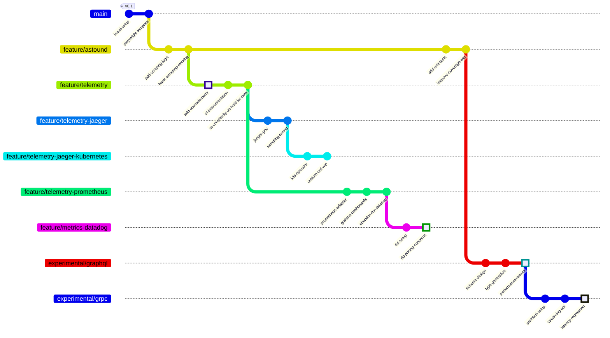

# frecklehugger

Git archaeology tool for exploring abandoned ideas.

## Motivation

This is an *experimental* tool for exploring how to gather knowledge from Git notes in abandoned feature branches.

Many Git repositories contain deeply nested feature branches that never get merged. Sometimes these failed experiments contain valuable lessons in their Git notes - why certain approaches were abandoned, what limitations were discovered, etc.

frecklehugger is an exploration of whether we can surface and reorganize these buried insights.

### An Example Repository with Dead Ends



Example Git notes we'd want to surface:

```bash
# Technical learnings in abandoned branches
git notes add -m "K8s operator adds too much complexity for our small team"
git notes add -m "GraphQL N+1 problems - would need significant caching"
git notes add -m "Streaming adds 45ms overhead. Batch REST endpoints better for our use case"
```

This is an experiment to see if collecting and organizing these notes provides any value.

## Quick Start

Install:
```bash
go install github.com/gkwa/frecklehugger@latest
```

Read notes:
```bash
frecklehugger notes .
```

## Example Usage

Create some test notes:

```bash 
# Initialize repo
git init 

# Make a commit
echo "hello" > file.txt
git add file.txt
git commit -m "first commit"

# Add notes
git notes add -m "Tried X but Y was a problem"

# View notes
frecklehugger notes .
```

## Installation from Source

Clone:
```bash
git clone https://github.com/gkwa/frecklehugger.git
```

Build:
```bash 
go build
```

Install:
```bash
go install
```

## Usage

```bash
frecklehugger notes [path]  # Get git notes from repository
frecklehugger version      # Print version info
```

## Configuration

Default config location: `$HOME/.frecklehugger.yaml`

Options:
```yaml
log-format: text # json or text
verbose: 2 # 0-3
```

Override with flags:
```bash
--log-format string   # json or text
-v, --verbose count   # Increase verbosity 
```

## Development

Run tests:
```bash
go test ./...
```

Run linter:
```bash 
golangci-lint run
```

## Help

```bash
frecklehugger help    # Get help
```

## Status


1. Do Git notes in abandoned branches contain useful knowledge?
2. Can we surface this knowledge in a useful way?
3. Is there value in collecting and organizing these "failed experiment" notes?
