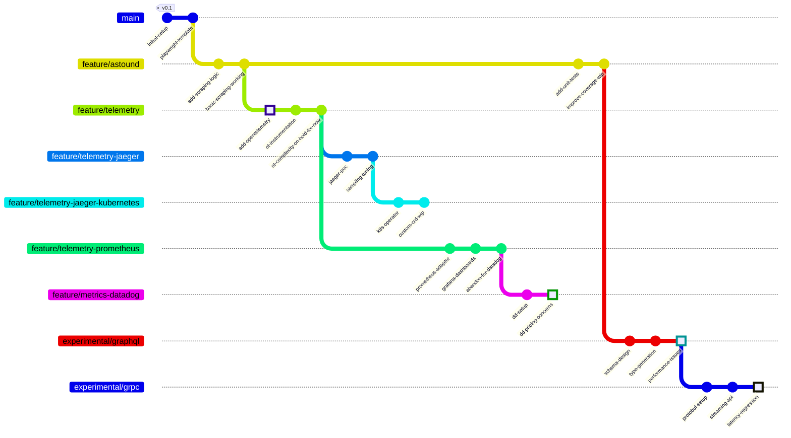

# frecklehugger

Git archaeology tool for excavating lost knowledge from abandoned feature branches.

## Motivation

When exploring new technical approaches, we often create experimental branches that never get merged. Despite being "dead ends", these branches frequently contain valuable insights in their Git notes:

- Failed approaches that seemed promising ("tried Jaeger but hit sampling limitations")
- Performance benchmarks ("GraphQL queries taking 2.5x longer than REST")
- Architectural decision records ("K8s operator too complex for our team size")
- Cost analyses ("Datadog pricing doesn't scale for our use case") 
- Dependencies that didn't pan out ("gRPC streaming increases latency by 30%")

This knowledge gets buried in Git notes across many abandoned feature branches. frecklehugger helps rediscover and organize these insights.

### Example Repository Structure



Example Git notes we want to surface:

```bash
# On commit dd-pricing-concerns
git notes add -m "Datadog costs would exceed $50k/month at our scale. Local Prometheus cheaper but needs dedicated team."

# On commit performance-issues  
git notes add -m "GraphQL N+1 queries causing 150ms p95 latency. Consider DataLoader or switching to gRPC."

# On commit latency-regression
git notes add -m "gRPC streaming adds 45ms overhead per request. Stick with REST endpoints for now."
```

frecklehugger helps discover and organize these scattered insights that would otherwise be lost in abandoned branches.

## Features

- Find Git notes across all branches
- Surface notes from abandoned feature branches
- Search notes by content
- Export notes in reusable formats
- CLI interface for easy integration

[Rest of README remains the same...]
```

## Features

Parse and read git notes from branches

## Quick Start

Install:
```bash
go install github.com/gkwa/frecklehugger@latest
```

Read notes:
```bash
frecklehugger notes .
```

## Example

Create git notes and view them:

```bash 
# Initialize repo
git init 

# Make a commit
echo "hello" > file.txt
git add file.txt
git commit -m "first commit"

# Add notes
git notes add -m "note content"

# View notes
frecklehugger notes .
```

## Installation from Source

Clone:
```bash
git clone https://github.com/gkwa/frecklehugger.git
```

Build:
```bash 
go build
```

Install:
```bash
go install
```

## Usage

```bash
frecklehugger notes [path]  # Get git notes from repository
frecklehugger version      # Print version info
```

## Configuration

Default config location: `$HOME/.frecklehugger.yaml`

Options:
```yaml
log-format: text # json or text
verbose: 2 # 0-3
```

Override with flags:
```bash
--log-format string   # json or text
-v, --verbose count   # Increase verbosity 
```

## Development

Run tests:
```bash
go test ./...
```

Run linter:
```bash 
golangci-lint run
```

## Help

```bash
frecklehugger help    # Get help
```